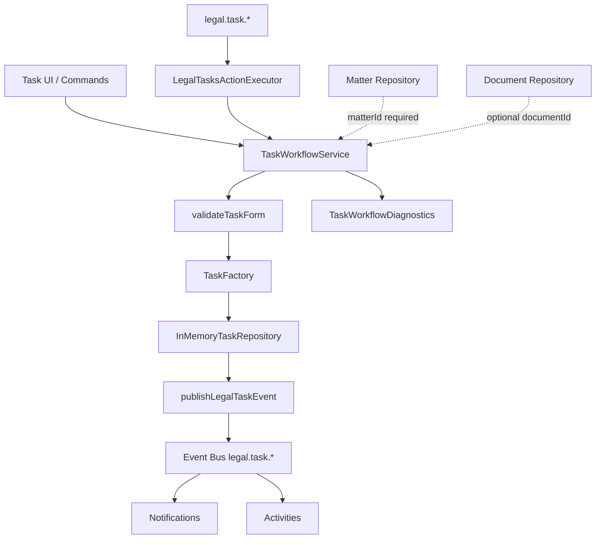
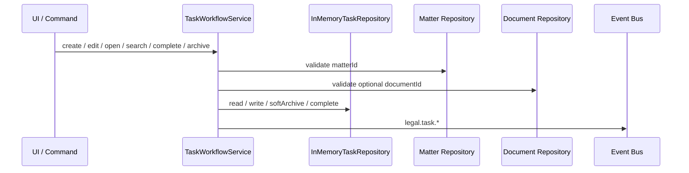

# LAW-005-01 — Task Management UX Validation Completion Report

> **Story:** LAW-005-01 — Task Management UX Validation  
> **Status:** **Complete** — await owner approval before LAW-005-02  
> **Platform baseline:** [Platform Version 5.0](../releases/APZHUB-Platform-v5.0.md) — **frozen**

---

## Summary

LAW-005-01 delivers the complete Task Management user experience using the Law Platform shell, LAW-001 UX foundation, and `@apzhub/legal-business-core`. Tasks are seeded in-memory (32 records), linked to existing matters, and optionally reference seeded documents. The full workflow pipeline (validation → factory → repository → events → notifications → activities) runs without persistence, APIs, or Platform changes.

---

## Screens implemented

| Screen      | Layout                | Route                                |
| ----------- | --------------------- | ------------------------------------ |
| Task list   | `LawListPageLayout`   | `/workspace/law/tasks`               |
| Task detail | `LawDetailPageLayout` | `/workspace/law/tasks/{taskId}`      |
| Create task | `LawFormPageLayout`   | `/workspace/law/tasks/new`           |
| Edit task   | `LawFormPageLayout`   | `/workspace/law/tasks/{taskId}/edit` |

### Task list filters

| Filter        | Implementation                           |
| ------------- | ---------------------------------------- |
| Search        | Title, reference, assignee, matter, tags |
| Status        | `TASK_STATUSES`                          |
| Priority      | `TASK_PRIORITIES`                        |
| Assigned user | `SEED_TASK_ASSIGNEES`                    |
| Matter        | In-memory matter repository              |
| Due date      | Overdue, today, this week, no due date   |

### Task relationships surfaced

| Relationship        | Source                                                                 |
| ------------------- | ---------------------------------------------------------------------- |
| Matter (required)   | `matterId` → in-memory matter repository                               |
| Document (optional) | `documentId` → in-memory document repository; validated against matter |
| Client (derived)    | From linked matter's `clientId` via `TaskFactory`                      |
| Assigned attorney   | `assigneeUserId` → seed assignees                                      |

---

## Deliverables

| Deliverable                     | Location                                                   |
| ------------------------------- | ---------------------------------------------------------- |
| Task lib                        | `apps/law-platform/lib/tasks/`                             |
| In-memory repository (32 seeds) | `apps/law-platform/lib/tasks/in-memory-task-repository.ts` |
| Seed assignees                  | `apps/law-platform/lib/tasks/seed-assignees.ts`            |
| Task UI                         | `apps/law-platform/components/tasks/`                      |
| Manifest                        | `services/legal-platform/manifests/law-tasks/module.yaml`  |
| Command handler                 | `apps/law-platform/lib/legal-tasks-command-handler.ts`     |
| Event publisher                 | `apps/law-platform/lib/publish-legal-task-event.ts`        |
| Integration tests               | `apps/law-platform/lib/task-workflow.integration.test.ts`  |
| This report                     | `docs/sprint/LAW-005-01-completion-report.md`              |

---

## Workflow diagram

### Command → event flow

---

## Architecture validation summary

| Diagnostic            | Validated                                                            |
| --------------------- | -------------------------------------------------------------------- |
| Commands executed     | `legal.task.open`, `create`, `edit`, `search`, `complete`, `archive` |
| Events raised         | `legal.task.viewed`, `created`, `updated`, `completed`, `archived`   |
| Notifications         | Unread count increases after create                                  |
| Activities            | Activity list populated after create                                 |
| Repository mutations  | create, update, complete, softArchive                                |
| Matter relationship   | create requires valid `matterId`; seeds link to `SEED_MATTERS`       |
| Document relationship | optional `documentId`; must belong to selected matter                |
| Complete workflow     | Sets `taskStatus: completed` and `completedAt` in-memory             |
| Archive workflow      | Soft archive via `cancelled` status + archived set                   |
| Validation failures   | Missing matter / invalid document recorded in diagnostics            |

---

## Commands, events, notifications, activities, knowledge

| Layer         | IDs                                                                                                 |
| ------------- | --------------------------------------------------------------------------------------------------- |
| Commands      | `legal.task.open`, `.create`, `.edit`, `.search`, `.complete`, `.archive`                           |
| Events        | `legal.task.viewed`, `.created`, `.updated`, `.completed`, `.archived`                              |
| Notifications | `legal.task.viewed.inbox`, `.created.toast`, `.edited.toast`, `.completed.toast`, `.archived.toast` |
| Activities    | `legal.activity.task.opened`, `.created`, `.edited`, `.completed`, `.archived`                      |
| Knowledge     | `legal.help.tasks.list`, `.create`, `.detail`                                                       |

---

## Platform validation summary

| Constraint                                | Status                                                                                     |
| ----------------------------------------- | ------------------------------------------------------------------------------------------ |
| No persistence                            | Pass                                                                                       |
| No APIs                                   | Pass                                                                                       |
| No database                               | Pass                                                                                       |
| No Platform 5.0 modifications             | Pass                                                                                       |
| Tasks belong to Matters                   | Pass — validation + seeds                                                                  |
| Optional document link                    | Pass — validation + seeds                                                                  |
| Client/Matter/Document pattern replicated | Pass                                                                                       |
| Quality gates                             | Pass — 292 test files, 1422 tests; law-platform typecheck clean; new task files lint clean |

---

## Technical debt

| Item                                        | Notes                                                                    |
| ------------------------------------------- | ------------------------------------------------------------------------ |
| No `TaskValidator` in Legal Business Core   | App-level `validateTaskForm` wraps domain enums + reference rules        |
| `documentId` is app-layer only              | Canonical `Task` in core has no document field; `ManagedTask` extends it |
| Search emits synthetic `legal.task.viewed`  | Consider dedicated search event in LAW-005-02                            |
| Knowledge `provides` uses `"document"` kind | Framework has no `"task"` document kind without Platform change          |
| Soft archive uses `cancelled` status        | Distinct from user-initiated status cancel in future persistence layer   |
| Session-scoped repository                   | Resets on page reload                                                    |
| Calendar integration                        | Deferred — not in LAW-005-01 scope                                       |

---

## Recommendation for LAW-005-02

After owner approval, LAW-005-02 should:

1. **Calendar views** — due-date driven task calendar using in-memory repository (still no persistence)
2. **Matter detail Tasks tab** — surface linked tasks from shared in-memory repository
3. **Dedicated search event** — replace synthetic `legal.task.viewed` on search
4. **Prepare persistence boundary** — `TaskRepository` adapter without introducing APIs yet
5. **Core alignment** — evaluate promoting `documentId` or archive semantics into `@apzhub/legal-business-core`

Do not introduce persistence, APIs, or Calendar until LAW-005-01 is explicitly approved for production path.

---

## Stop condition

LAW-005-01 is complete. **Await owner approval** before LAW-005-02, Calendar, persistence, or APIs.
