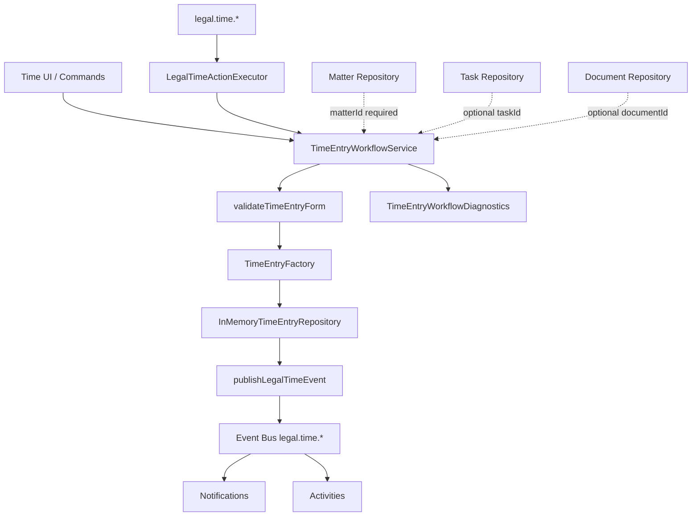
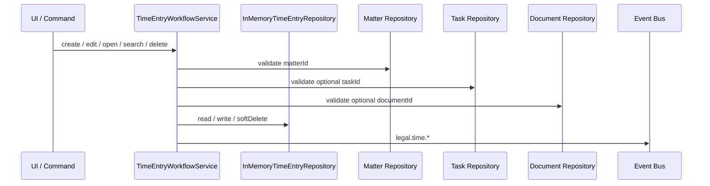

# LAW-006-01 — Time Recording UX Validation Completion Report

> **Story:** LAW-006-01 — Time Recording UX Validation  
> **Status:** **Complete** — await owner approval before LAW-006-02  
> **Platform baseline:** [Platform Version 5.0](../releases/APZHUB-Platform-v5.0.md) — **frozen**

---

## Summary

LAW-006-01 delivers the complete Time Recording user experience using the Law Platform shell, LAW-001 UX foundation, and `@apzhub/legal-business-core`. Time entries are seeded in-memory (42 records), linked to existing matters, and optionally reference tasks and documents. The full workflow pipeline (validation → factory → repository → events → notifications → activities) runs without persistence, APIs, timers, or Platform changes.

---

## Screens implemented

| Screen            | Layout                | Route                                    |
| ----------------- | --------------------- | ---------------------------------------- |
| Time entry list   | `LawListPageLayout`   | `/workspace/law/time`                    |
| Time entry detail | `LawDetailPageLayout` | `/workspace/law/time/{timeEntryId}`      |
| Record time       | `LawFormPageLayout`   | `/workspace/law/time/new`                |
| Edit time entry   | `LawFormPageLayout`   | `/workspace/law/time/{timeEntryId}/edit` |

### Time entry list filters

| Filter   | Implementation                                          |
| -------- | ------------------------------------------------------- |
| Search   | Description, reference, matter, attorney, activity code |
| Date     | Today, this week, this month, last 30 days              |
| Matter   | In-memory matter repository                             |
| Task     | Tasks scoped to selected matter                         |
| Attorney | `SEED_TIME_ATTORNEYS`                                   |
| Billable | Billable / non-billable                                 |

### Time entry relationships surfaced

| Relationship        | Source                                                                 |
| ------------------- | ---------------------------------------------------------------------- |
| Matter (required)   | `matterId` → in-memory matter repository                               |
| Task (optional)     | `taskId` → in-memory task repository; validated against matter         |
| Document (optional) | `documentId` → in-memory document repository; validated against matter |
| Attorney            | `userId` → seed attorneys with display-only default rates              |

### Form behaviour

| Feature           | Implementation                                                    |
| ----------------- | ----------------------------------------------------------------- |
| Manual duration   | `durationMinutes` input (required when start/end not used)        |
| Start / end times | Optional `datetime-local` fields; duration computed when both set |
| Rate              | Display-only from attorney seed data — not editable               |
| Timer             | **Not implemented** — deferred by design (LAW-006-01 constraint)  |

---

## Deliverables

| Deliverable                     | Location                                                           |
| ------------------------------- | ------------------------------------------------------------------ |
| Time lib                        | `apps/law-platform/lib/time/`                                      |
| `TimeEntryFactory`              | `packages/legal-business-core/src/factories/time-entry-factory.ts` |
| In-memory repository (42 seeds) | `apps/law-platform/lib/time/in-memory-time-entry-repository.ts`    |
| Seed attorneys & rates          | `apps/law-platform/lib/time/seed-attorneys.ts`                     |
| Time UI                         | `apps/law-platform/components/time/`                               |
| Manifest                        | `services/legal-platform/manifests/law-time/module.yaml`           |
| Command handler                 | `apps/law-platform/lib/legal-time-command-handler.ts`              |
| Event publisher                 | `apps/law-platform/lib/publish-legal-time-event.ts`                |
| Integration tests               | `apps/law-platform/lib/time-entry-workflow.integration.test.ts`    |
| This report                     | `docs/sprint/LAW-006-01-completion-report.md`                      |

---

## Workflow diagram

### Command → event flow

---

## Architecture validation summary

| Diagnostic            | Validated                                                      |
| --------------------- | -------------------------------------------------------------- |
| Commands executed     | `legal.time.open`, `create`, `edit`, `search`, `delete`        |
| Events raised         | `legal.time.viewed`, `created`, `updated`, `deleted`           |
| Notifications         | Unread count increases after create                            |
| Activities            | Activity list populated after create                           |
| Repository mutations  | create, update, softDelete                                     |
| Matter relationship   | create requires valid `matterId`; seeds link to `SEED_MATTERS` |
| Task relationship     | optional `taskId`; must belong to selected matter              |
| Document relationship | optional `documentId`; must belong to selected matter          |
| Manual duration       | Form accepts minutes or start/end computation                  |
| Soft delete           | Entry removed from list via `softDeletedIds` set               |
| Validation failures   | Missing matter / invalid task recorded in diagnostics          |

---

## Commands, events, notifications, activities, knowledge

| Layer         | IDs                                                                            |
| ------------- | ------------------------------------------------------------------------------ |
| Commands      | `legal.time.open`, `.create`, `.edit`, `.search`, `.delete`                    |
| Events        | `legal.time.viewed`, `.created`, `.updated`, `.deleted`                        |
| Notifications | `legal.time.viewed.inbox`, `.created.toast`, `.edited.toast`, `.deleted.toast` |
| Activities    | `legal.activity.time.opened`, `.created`, `.edited`, `.deleted`                |
| Knowledge     | `legal.help.time.list`, `.create`, `.detail`                                   |

---

## Platform validation summary

| Constraint                                     | Status                                                                                     |
| ---------------------------------------------- | ------------------------------------------------------------------------------------------ |
| No persistence                                 | Pass                                                                                       |
| No APIs                                        | Pass                                                                                       |
| No database                                    | Pass                                                                                       |
| No timers                                      | Pass                                                                                       |
| No Platform 5.0 modifications                  | Pass                                                                                       |
| Time entries belong to Matters                 | Pass — validation + seeds                                                                  |
| Optional task / document links                 | Pass — validation + seeds                                                                  |
| Client/Matter/Document/Task pattern replicated | Pass                                                                                       |
| Quality gates                                  | Pass — 297 test files, 1433 tests; law-platform typecheck clean; new time files lint clean |

---

## Technical debt

| Item                                                              | Notes                                                                                         |
| ----------------------------------------------------------------- | --------------------------------------------------------------------------------------------- |
| No `TimeEntryValidator` in Legal Business Core                    | App-level `validateTimeEntryForm` wraps domain enums + reference rules                        |
| `taskId`, `documentId`, `startTime`, `endTime` are app-layer only | Canonical `TimeEntry` in core has no task/document/time fields; `ManagedTimeEntry` extends it |
| Search emits synthetic `legal.time.viewed`                        | Consider dedicated search event in LAW-006-02                                                 |
| Rate is display-only seed data                                    | No billing rate tables or matter-specific rates yet                                           |
| Knowledge `provides` uses `"document"` kind                       | Framework has no `"time"` document kind without Platform change                               |
| Session-scoped repository                                         | Resets on page reload                                                                         |
| Timer / stopwatch UX                                              | Explicitly deferred — not in LAW-006-01 scope                                                 |
| Billing integration                                               | Deferred — no invoice or WIP ledger wiring                                                    |

---

## Recommendation for LAW-006-02

After owner approval, LAW-006-02 should:

1. **Timer UX** — start/stop timer with in-memory session state (still no persistence)
2. **Matter detail Time tab** — surface linked time entries from shared in-memory repository
3. **Dedicated search event** — replace synthetic `legal.time.viewed` on search
4. **Calendar views** — time entries by date alongside task due dates (in-memory)
5. **Prepare persistence boundary** — `TimeRepository` adapter without introducing APIs yet
6. **Billing preview** — read-only WIP summary from in-memory entries (no invoicing APIs)

Do not introduce persistence, APIs, Billing, or Calendar until LAW-006-01 is explicitly approved for production path.

---

## Stop condition

LAW-006-01 is complete. **Await owner approval** before LAW-006-02, Calendar, Billing, persistence, or APIs.
