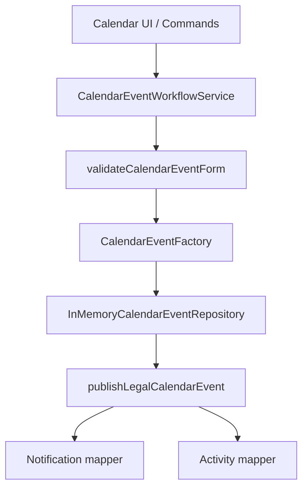

# LAW-008-01 — Calendar UX Validation Completion Report

> **Story:** LAW-008-01 — Calendar UX Validation  
> **Status:** **Complete** — await owner approval before LAW-008-02, Billing, persistence, APIs, or external calendar sync  
> **Platform baseline:** [Platform Version 5.0](../releases/APZHUB-Platform-v5.0.md) — **frozen**

---

## Summary

LAW-008-01 delivers Calendar Management using the same in-memory workflow pattern as Clients, Matters, Documents, Tasks, Time, and Search. Calendar events relate to matters and optionally to clients, tasks, documents, and time entries. No database, APIs, persistence, Platform 5.0 changes, or external calendar integration were introduced.

---

## Deliverables

| Deliverable                       | Location                                                                |
| --------------------------------- | ----------------------------------------------------------------------- |
| `CalendarEventFactory`            | `packages/legal-business-core/src/factories/calendar-event-factory.ts`  |
| `CalendarRepository` (core)       | `packages/legal-business-core/src/repositories/index.ts`                |
| `InMemoryCalendarEventRepository` | `apps/law-platform/lib/calendar/in-memory-calendar-event-repository.ts` |
| 37 seed events                    | `apps/law-platform/lib/calendar/seed-calendar-events.ts`                |
| Workflow service                  | `apps/law-platform/lib/calendar/calendar-event-workflow-service.ts`     |
| UI (list, detail, form, context)  | `apps/law-platform/components/calendar/`                                |
| Commands / manifest               | `services/legal-platform/manifests/law-calendar/module.yaml`            |
| Unified search provider           | `legal.calendar.search` in KDF registration                             |
| Integration tests                 | `calendar-event-workflow.integration.test.ts`                           |

---

## Calendar workflow

**Executor chain:** `LegalSearchActionExecutor` → `LegalTimeActionExecutor` → `LegalCalendarActionExecutor` → … → platform bridge

---

## Commands & events

| Command                 | Handler                         | Event(s)                                                 |
| ----------------------- | ------------------------------- | -------------------------------------------------------- |
| `legal.calendar.open`   | `service:legal-calendar:open`   | `legal.calendar.viewed`                                  |
| `legal.calendar.create` | `service:legal-calendar:create` | navigates to form; create emits `legal.calendar.created` |
| `legal.calendar.edit`   | `service:legal-calendar:edit`   | navigates to form; save emits `legal.calendar.updated`   |
| `legal.calendar.search` | `service:legal-calendar:search` | `legal.calendar.viewed` (search)                         |
| `legal.calendar.cancel` | `service:legal-calendar:cancel` | `legal.calendar.cancelled`                               |

---

## Knowledge

| Source ID                    | Purpose                       |
| ---------------------------- | ----------------------------- |
| `legal.help.calendar.list`   | List view help                |
| `legal.help.calendar.create` | Create form help              |
| `legal.help.calendar.detail` | Detail view help              |
| `legal.calendar.search`      | Unified Legal Search provider |

---

## Seed coverage

37 in-memory events spanning court appearances, consultations, filing deadlines, document review, client meetings, internal review, and conveyancing deadlines — linked to existing seed matters and clients.

---

## Architecture validation

| Check                                  | Result                                                |
| -------------------------------------- | ----------------------------------------------------- |
| No Platform 5.0 package changes        | Pass — app-layer only + `legal-business-core` factory |
| In-memory repository pattern           | Pass                                                  |
| Event → notification → activity wiring | Pass                                                  |
| Unified search (no new search system)  | Pass — 6th KDF provider                               |
| Manifest-driven commands               | Pass                                                  |
| Context panel summary                  | Pass                                                  |

---

## Technical debt

1. Day/week/month views are placeholder tabs only.
2. No recurrence or external sync.
3. Reminder minutes stored but not dispatched.
4. Session-only in-memory data.

---

## Recommendation for LAW-008-02

Focus on interactive day/week/month grid views, matter-scoped calendar entry points, and dashboard deadline widgets before persistence. Defer PostgreSQL, APIs, and Outlook/Google sync until approved.

---

## Stop condition

LAW-008-01 is complete. Stopped per story scope.
