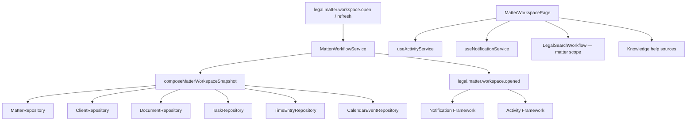

# LAW-009-01 — Matter Workspace Validation Completion Report

> **Story:** LAW-009-01 — Matter Workspace Validation  
> **Status:** **Complete** — await owner approval before LAW-009-02, Billing, persistence, APIs, or Trust Accounting  
> **Platform baseline:** [Platform Version 5.0](../releases/APZHUB-Platform-v5.0.md) — **frozen**

---

## Summary

LAW-009-01 delivers the primary **Matter Workspace** as a composition layer over validated Law Platform modules. The workspace at `/workspace/law/matters/{matterId}/workspace` uses `LawWorkspaceLayout` and aggregates matter, client, document, task, time, and calendar data from existing in-memory repositories — without new business modules, persistence, APIs, or Platform changes.

---

## Workspace architecture

---

## Composed sections

| Section                                  | Source                                             |
| ---------------------------------------- | -------------------------------------------------- |
| Matter summary                           | `Matter` + lookups                                 |
| Client summary                           | `ClientRepository`                                 |
| Documents                                | `DocumentRepository.list({ matterId })`            |
| Tasks (open / overdue / upcoming)        | `TaskRepository`                                   |
| Time (recent, total, billable hours)     | `TimeEntryRepository`                              |
| Calendar (upcoming, hearings, deadlines) | `CalendarEventRepository`                          |
| Activity timeline                        | `useActivityService()` — no duplicate store        |
| Notifications                            | `useNotificationService()` — no duplicate store    |
| Knowledge                                | Registered help sources                            |
| Search                                   | `LegalSearchWorkflow` with `mergeLegalSearchScope` |
| Context panel                            | Diagnostics + related entity counts                |

---

## Commands & events

| Command                          | Handler                                   | Event                                      |
| -------------------------------- | ----------------------------------------- | ------------------------------------------ |
| `legal.matter.workspace.open`    | `service:legal-matters:workspace-open`    | `legal.matter.workspace.opened`            |
| `legal.matter.workspace.refresh` | `service:legal-matters:workspace-refresh` | (re-composes snapshot; no duplicate event) |

---

## Key paths

| Artifact             | Path                                                                       |
| -------------------- | -------------------------------------------------------------------------- |
| Composition          | `apps/law-platform/lib/matters/matter-workspace-composition.ts`            |
| Workspace page       | `apps/law-platform/components/matters/matter-workspace-page.tsx`           |
| Context panel        | `apps/law-platform/components/matters/matter-workspace-context-panel.tsx`  |
| Matter-scoped search | `apps/law-platform/components/matters/matter-workspace-search-section.tsx` |
| Route                | `/workspace/law/matters/{matterId}/workspace`                              |
| Integration tests    | `matter-workspace.integration.test.ts`                                     |

---

## Composition validation

| Check                                               | Result                             |
| --------------------------------------------------- | ---------------------------------- |
| No new repositories                                 | Pass — reads existing shared repos |
| No duplicate timeline                               | Pass — `useActivityService`        |
| No duplicate notifications                          | Pass — `useNotificationService`    |
| No duplicate search                                 | Pass — `LegalSearchWorkflow` + KDF |
| No Platform 5.0 changes                             | Pass                               |
| No persistence / APIs / Billing                     | Pass                               |
| Shell timeline + notification panels remain primary | Pass                               |

---

## Technical debt

1. Activity timeline is personal scope — matter-specific filtering deferred to LAW-009-02.
2. Knowledge section lists source IDs; inline help content not rendered yet.
3. Task quick-create navigates to form route placeholder only.
4. Client communication details derived from tags/custom fields — no Contact entity repository.
5. Workspace refresh is in-memory re-read only; no optimistic cross-module sync.

---

## Recommendation for LAW-009-02

After owner approval:

1. Matter-scoped activity timeline filter (payload.matterId).
2. Deep-linkable workspace tabs and dashboard widgets.
3. Inline knowledge help rendering from `legal.help.matter.workspace`.
4. Quick actions (create task, record time, schedule event) pre-scoped from workspace.
5. Prepare persistence boundary — composition function already centralised.

---

## Stop condition

LAW-009-01 is complete. Stopped per story scope.
