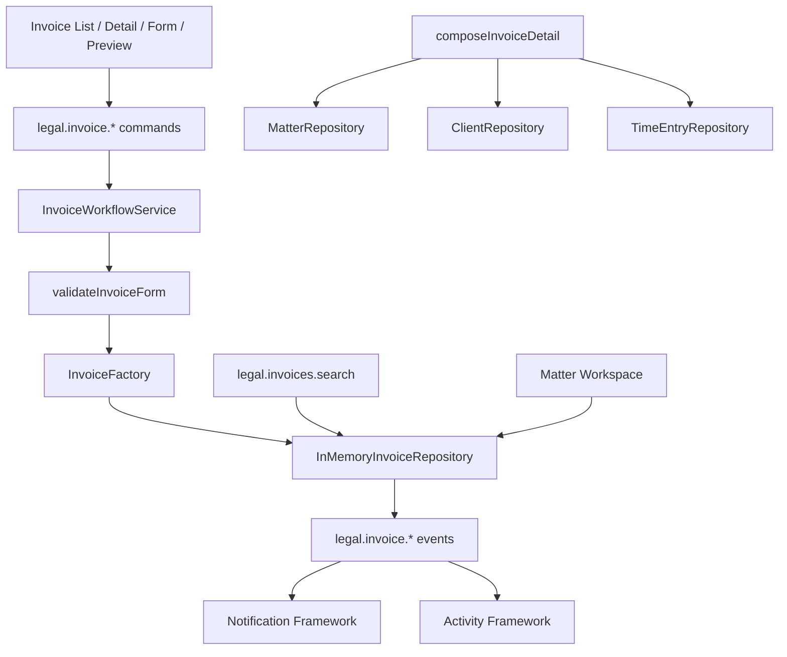

# LAW-010-01 — Billing UX Validation Completion Report

> **Story:** LAW-010-01 — Billing UX Validation  
> **Status:** **Complete** — await owner approval before persistence, APIs, Trust Accounting, or financial integrations  
> **Platform baseline:** [Platform Version 5.0](../releases/APZHUB-Platform-v5.0.md) — **frozen**

---

## Summary

LAW-010-01 delivers the Billing domain as an in-memory UX validation module at `/workspace/law/billing`. Invoices aggregate matter, client, and time entry data via `InvoiceFactory` and `composeInvoiceDetail()`, with placeholder expenses and disbursements. Twenty-two seed invoices link to existing matters and time entries.

---

## Billing architecture

---

## Implemented scope

| Feature                          | Status   |
| -------------------------------- | -------- |
| Invoice List                     | Complete |
| Invoice Detail                   | Complete |
| Create Invoice                   | Complete |
| Edit Invoice                     | Complete |
| Cancel Invoice (void)            | Complete |
| Mark Paid (in-memory)            | Complete |
| Invoice Preview                  | Complete |
| Unified Legal Search provider    | Complete |
| Matter Workspace billing section | Complete |

---

## Invoice composition

| Field                      | Source                                            |
| -------------------------- | ------------------------------------------------- |
| Matter                     | `matterId` + `MatterRepository`                   |
| Client                     | `clientId` + `ClientRepository`                   |
| Time entries               | Line items linked to `TimeEntryRepository`        |
| Expenses                   | Placeholder amount on `ManagedInvoice`            |
| Disbursements              | Placeholder amount on `ManagedInvoice`            |
| Taxes / Totals             | `InvoiceFactory.calculateInvoiceTotals` (10% GST) |
| Reference / Status / Dates | `Invoice` entity                                  |

---

## Commands & events

| Command                   | Event(s)                                |
| ------------------------- | --------------------------------------- |
| `legal.invoice.open`      | `legal.invoice.viewed`                  |
| `legal.invoice.create`    | `legal.invoice.created`                 |
| `legal.invoice.edit`      | `legal.invoice.updated`                 |
| `legal.invoice.cancel`    | `legal.invoice.cancelled`               |
| `legal.invoice.mark-paid` | `legal.invoice.paid`                    |
| `legal.invoice.search`    | `legal.invoice.viewed` (search context) |

---

## Key paths

| Artifact           | Path                                                            |
| ------------------ | --------------------------------------------------------------- |
| InvoiceFactory     | `packages/legal-business-core/src/factories/invoice-factory.ts` |
| Repository + seeds | `apps/law-platform/lib/billing/`                                |
| Workflow           | `apps/law-platform/lib/billing/invoice-workflow-service.ts`     |
| UI                 | `apps/law-platform/components/billing/`                         |
| Integration tests  | `apps/law-platform/lib/invoice-workflow.integration.test.ts`    |

---

## Technical debt

1. Expenses and disbursements are placeholder amounts — no Expense/Disbursement entities yet.
2. Mark Paid is status-only — no payment records or trust accounting.
3. Time entries remain `unbilled` after invoicing — no billing status sync.
4. Tax rate is fixed at 10% — no jurisdiction or client-specific rules.
5. Invoice list matter filter via query param not yet wired in list page UI.

---

## Recommendation for LAW-010-02

After owner approval:

1. Sync `billingStatus` on time entries when invoiced.
2. Real Expense and Disbursement line item types.
3. Payment entity and partial payment support.
4. Trust accounting boundary design.
5. Persistence adapter behind `InvoiceRepository`.

---

## Stop condition

LAW-010-01 is complete. Stopped per story scope.
