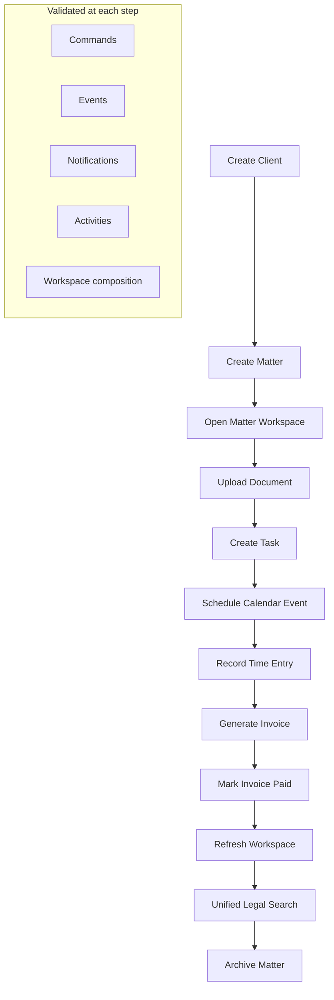

# LAW-011-01 — End-to-End Matter Lifecycle Validation Completion Report

> **Story:** LAW-011-01 — End-to-End Matter Lifecycle Validation  
> **Status:** **Complete** — await owner approval before persistence architecture design  
> **Platform baseline:** [Platform Version 5.0](../releases/APZHUB-Platform-v5.0.md) — **frozen**

---

## Summary

LAW-011-01 validates that a complete legal matter can be managed from beginning to end using the current Law Platform. A single integration suite exercises all implemented modules together — Client, Matter, Document, Task, Calendar, Time, Billing, Unified Search, Matter Workspace, Notifications, Activities, and Knowledge — with no new business module, persistence, or Platform changes.

---

## Matter lifecycle diagram

---

## Validation scenario executed

| Step              | Module    | Command                          | Event                           |
| ----------------- | --------- | -------------------------------- | ------------------------------- |
| Create Client     | Clients   | `legal.client.create`            | `legal.client.created`          |
| Create Matter     | Matters   | `legal.matter.create`            | `legal.matter.created`          |
| Open Workspace    | Matters   | `legal.matter.workspace.open`    | `legal.matter.workspace.opened` |
| Upload Document   | Documents | `legal.document.create`          | `legal.document.created`        |
| Create Task       | Tasks     | `legal.task.create`              | `legal.task.created`            |
| Schedule Event    | Calendar  | `legal.calendar.create`          | `legal.calendar.created`        |
| Record Time       | Time      | `legal.time.create`              | `legal.time.created`            |
| Generate Invoice  | Billing   | `legal.invoice.create`           | `legal.invoice.created`         |
| Mark Paid         | Billing   | `legal.invoice.mark-paid`        | `legal.invoice.paid`            |
| Refresh Workspace | Matters   | `legal.matter.workspace.refresh` | (re-compose only)               |
| Unified Search    | Search    | `legal.search.execute`           | `legal.search.executed`         |
| Archive Matter    | Matters   | `legal.matter.archive`           | `legal.matter.archived`         |

Search token: `LIFECYCLE-E2E-2026` — applied to all created entities for cross-module discoverability.

---

## Architecture validation

| Area                         | Result                                                                 |
| ---------------------------- | ---------------------------------------------------------------------- |
| Command framework dispatch   | Pass — all module commands route through manifest-aware executor chain |
| Event bus wiring             | Pass — domain events flow to notifications and activities              |
| Knowledge framework          | Pass — 9 help sources + 7 search providers registered and exercised    |
| Matter Workspace composition | Pass — entity counts and billing section update after each step        |
| In-memory repositories       | Pass — mutations isolated per test run                                 |
| No Platform 5.0 changes      | Pass                                                                   |
| No persistence / APIs        | Pass                                                                   |

---

## Product validation findings

1. **Full lifecycle is operable** — a matter can progress from client intake through billing simulation and archival entirely in-memory.
2. **Workspace composition is coherent** — document, task, calendar, time, and billing sections reflect repository state after each workflow step.
3. **Unified search discovers all entity types** — client, matter, document, task, time entry, calendar event, and invoice appear in a single search query.
4. **Notifications and activities accumulate** — each mutating step produces inbox/toast notifications and timeline entries.
5. **Cross-module linking works** — tasks link to documents, time entries link to tasks/documents, invoices aggregate time entries, calendar events link to tasks.

---

## End-to-end execution report (automated)

The integration suite produces a structured report via `buildMatterLifecycleExecutionReport()`:

| Metric                        | Validated                                |
| ----------------------------- | ---------------------------------------- |
| Workflow duration             | Total ms tracked per run                 |
| Commands executed             | Aggregated from all workflow diagnostics |
| Events published              | Aggregated from all workflow diagnostics |
| Notifications generated       | Notification service unread count        |
| Activities generated          | Activity service list count              |
| Knowledge providers exercised | 9 help sources                           |
| Search providers exercised    | 7 entity search indexes                  |
| Repository mutations          | Per-module mutation counts               |
| Validation failures           | Must be zero                             |
| Navigation routes             | Command-driven route changes recorded    |

**Test file:** `apps/law-platform/lib/matter-lifecycle.integration.test.ts`  
**Report builder:** `apps/law-platform/lib/matter-lifecycle-report.ts`

---

## Technical debt register

| ID         | Item                                             | Impact                                      |
| ---------- | ------------------------------------------------ | ------------------------------------------- |
| TD-L011-01 | Time entries remain `unbilled` after invoicing   | Billing status not synced across modules    |
| TD-L011-02 | Mark Paid is status-only simulation              | No payment entity or trust accounting       |
| TD-L011-03 | Archive is soft-delete in memory                 | No retention or audit trail persistence     |
| TD-L011-04 | Workspace activity timeline is personal scope    | Not matter-filtered                         |
| TD-L011-05 | Search date filters approximate for time entries | Uses `last_30_days` proxy                   |
| TD-L011-06 | No cross-module transaction boundary             | Partial lifecycle state possible on failure |

---

## Recommendations before persistence

1. **Design persistence at the workflow boundary** — each `*WorkflowService` already centralises validate → factory → repository → events; add adapter interfaces without changing UI.
2. **Introduce billing status sync** — when an invoice is created, mark linked time entries as billed.
3. **Add matter-scoped activity filtering** — filter timeline by `payload.matterId` before persistence.
4. **Define lifecycle transaction semantics** — decide rollback/compensation for multi-module operations.
5. **Plan archival retention policy** — soft archive vs hard delete, matter reopen rules.

---

## Stop condition

LAW-011-01 is complete. Stopped per story scope — no persistence architecture work begun.
